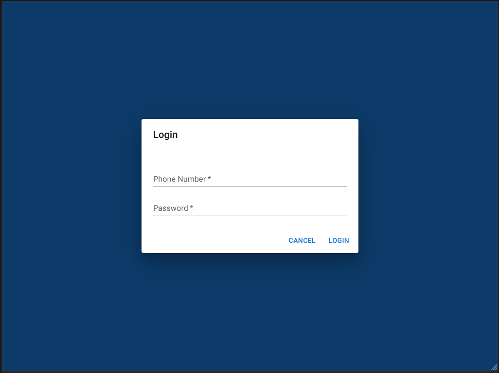
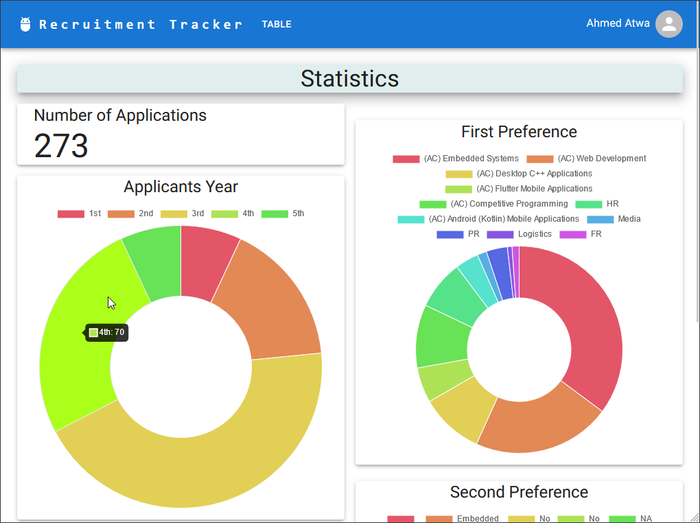
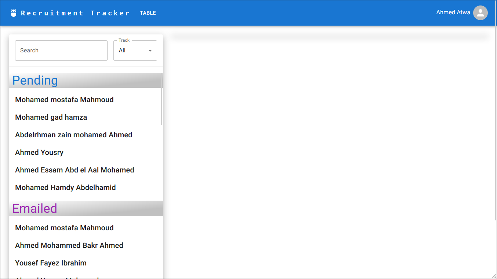
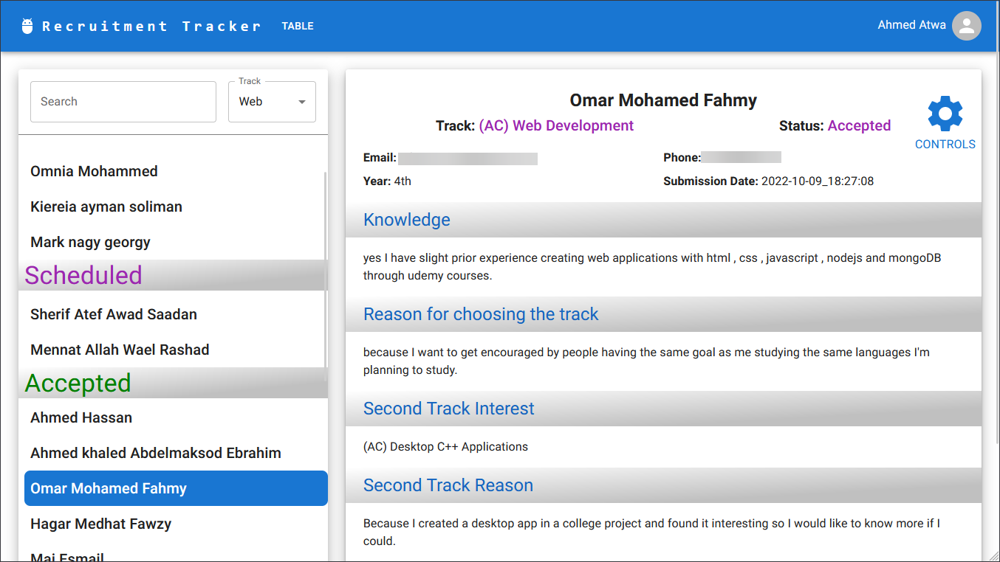

# Recruitment Tracker Application

## Description

This is a full-stack application built with React.js, Node.js, Express, and MongoDB (MERN stack). It is a recruitment tracker application designed to streamline the member recruitment process for the Semicolon student organization at Ain Shams University in 2022. The application provides a centralized platform for HR to manage candidate applications and track their progress through the recruitment pipeline. With features such as authentication, authorization, candidate search and filter, and a fully responsive dashboard, the application simplifies the recruitment process and improves the efficiency of HR operations.

## Features

- Authentication (login, logout)
    - Uses JWT
    - Takes phone number and password
    - Stores token in local storage to keep the user logged in after refreshing the page. It lasts for 1 hour or until the user logs out.
- Authorization (admin, basic)
    - Admins can edit candidates' status
    - Basic users can only view candidates
- Dashboard page
    - General statistics and charts
    - Displays the number of candidates in each track and in each acedemic year.
    - Uses Pie Charts from Chart.js
- View candidates & edit candidates
    - Candidates are categorized by status
    - All data fields are displayed, ex: name, phone, email, track, status, etc.
    - Edit candidates' status, ex: Accepted, Rejected, Pending, Mailed, etc.
- Add & delete candidates
- Search & filter candidates
    - Search by name
    - Filter by track
- Fully responsive
    - The application adapts to different screen sizes and resolutions to ensure optimal user experience on desktops, laptops, tablets, and mobile devices.
    - Uses Material UI's responsive grid system


## Deployment & Infrastructure

Frontend: Vercel (Next.js)
- [Live Demo](https://recruitment-tracker-frontend.vercel.app/)

Backend: Render (Node.js)
- [Live Demo](https://recruitment-tracker-backend.onrender.com/)

**Note:** The backend is deployed on Render on a free plan, so it might take up to 2 minutes to load the first time.

**Note:** You won't be able to login to the application because accounts are only created by the admin.

## Screenshots

The Login Page


The Dashboard Page


The Candidates Page


The Candidates Page with candidate selected


## Technologies Used

- React.js
- Node.js
- Express
- MongoDB
- Next.js
- TypeScript
- Material UI

# Architecture

## Frontend

The frontend is built using Next.js, which is a React framework that allows for server side rendering. It uses TypeScript for type safety and Material UI for styling.

The frontend folder structure:
- components: components that are used in pages
- pages: the pages of the application
- public: static files
- styles: stylesheets for the components
- utils: utility functions
    - apis: functions that make requests to the backend
    - services: functions that are used in multiple pages & authentication
    - types: typescript types
    - config.ts: configuration file that contains the backend url

### Pages
- Login Page
    - Login form for the user to login
    - Redirects to the dashboard page if the user is authenticated
    - The user is authenticated by checking if the token is stored in the local storage
    - `/login`

- Dashboard Page
    - Displays general statistics and charts about the candidates.
    - `/`

- Candidates Page
    - Displays a table of all candidates.
    - Candidates are categorized by status.
    - The table can be filtered by track.
    - The table can be searched by name.
    - Contains controls to edit the candidates' status.
    - `/table`


## Backend

The backend is built using Node.js and Express. It uses MongoDB as a database and Mongoose as an ODM. It uses TypeScript for type safety.

### Filling the database from Google Forms

The database is connected to a Google Form used for the recruitment process. The form responses are automatically added to the database using a script that runs on new form submissions.

### API Endpoints

- POST /login
    - Body: { phone: string, password: string }
    - Returns the user object if the credentials are correct

- GET /logout
    - Authentication: basic
    - Returns the user object

- GET /memberapplications
    - Authentication: basic
    - Returns all candidates

- PUT /memberapplications
    - Authentication: admin
    - Body: { _id: string, ... }
    - Updates the candidate with the given id with the given data fields

- PUT /memberapplications/multi
    - Authentication: admin
    - Body: { multi: { _id: string, ... }[] }
    - Updates the candidates with the given ids with the given data fields

### Authentication & Authorization

The authentication is done using JWT. The user is authenticated by sending the JWT token in the Authorization header. The authorization is done by checking the user role in the database.

### Database Models

- User
    - name: string
    - phone: string
    - password: string
    - role: "admin" | "basic

- [MemberApplication](backend/src/models/memberApplications.model.tsmemberApplications.model.ts)

## Backend Scripts

These are custom scripts used to make mass changes to the database. They are not used in the application, but they are useful for the admin to make changes to the database.

They were used to:
- Normalize track names of the same track.
    - This was required because track names were changed during the recruitment process.
    - Example: "Web" was renamed to "(AC) Web Development" so all candidates with the track "Web" were changed to "(AC) Web Development".
- Get all email addresses of candidates of a specific track and a specific status.
    - This was required to send emails to candidates of a specific track and a specific status.
    - Example: Getting all email addresses of candidates of the track "Web" and the status "Rejeced" to send them a rejection email.

**Note:** A better solution for mass changes in the backend would have been to directly access and edit the database from the backend models, instead of running the local server and hitting the endpoints.

## How to install

### Prerequisites

- Node.js & npm

### Frontend

1. Clone the repository
2. `cd frontend`
3. `npm install`

### Backend

1. Clone the repository
2. `cd backend`
3. `npm install`

.env file:
```env
# PORT
PORT = 4000

# MONGODB, replace ***** with your MongoDB URI
MONGO_URI=*****

# TOKEN, replace ***** with your JWT secret key
SECRET_KEY = ******
```

## How to run

### Frontend

1. `cd frontend`
2. `npm run dev`

### Backend

1. `cd backend`
2. `npm run dev`


# Contributors

### [Ahmed Atwa](https://github.com/Deadreyo)

    Created the frontend website.

### [Mahmoud Hamdy](https://github.com/MahmoudHamdy02)

    Created the backend and the database.